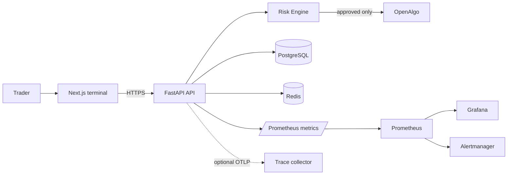

# QuantGPT production architecture

## Boundaries

- OpenAlgo remains an external trading authority. QuantGPT never writes into its codebase.
- Every order is evaluated by the Risk Engine before the integration facade can send it to OpenAlgo.
- PostgreSQL stores durable application state and audit metadata; Redis is cache/coordination only.
- Prometheus, Grafana, Alertmanager, Redis and PostgreSQL stay on private Docker networks. Only the frontend should be published through a TLS reverse proxy.

## Reliability model

- Liveness: `GET /api/v1/health`; readiness: `GET /api/v1/health/ready`.
- Metrics: `GET /metrics` on the internal monitoring network only.
- Stateful changes create an append-only audit record containing request metadata, never payloads or credentials.
- Backups are PostgreSQL custom-format dumps with checksums. Recovery is a deliberate, confirmation-gated operation.

## Security model

- Secrets are runtime-only values from a secret manager or Docker/Kubernetes secrets; `.env` is development-only and ignored by Git.
- Production refuses default admin credentials, short JWT secrets, and HTTP CORS origins.
- Trusted hosts, CORS, security headers, request IDs, rate limiting and non-root containers reduce common API risks.
- Retain audit logs and backups according to the organisation’s legal and regulatory policy.
